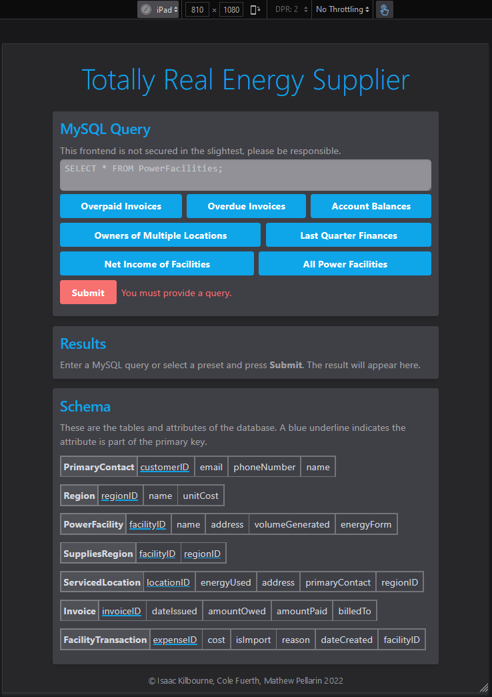

# Totally A Real Energy Supplier Frontend

**This is the frontend for a group project in COMP3150.** It is a simple frontend that allows issuing MySQL queries to [a backend](https://github.com/kilbouri/comp3150-backend). It was made in under a week using **Svelte** and **TailwindCSS**.

It offers both a light and dark mode based on the system preference.

## Running

```sh
# install dependencies:
yarn

# to host:
yarn host

# to develop:
yarn dev
```

## Screenshots




